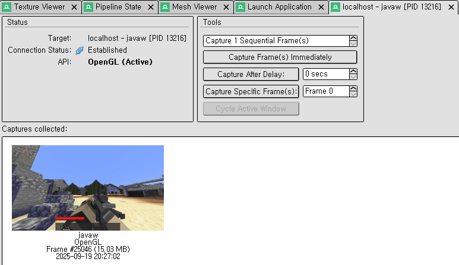
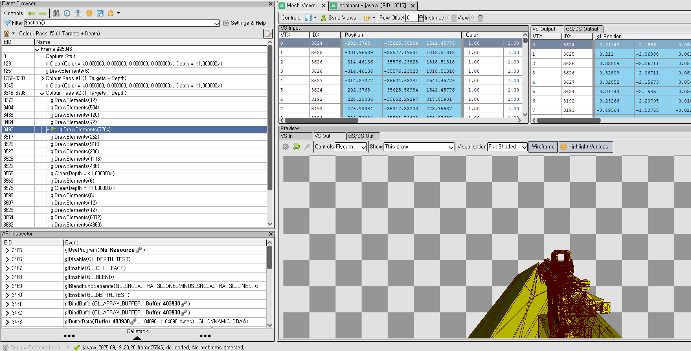

# 연결
RenderDoc를 실행시켜 좌측 상단 File.. Attach to Running Instance..  
본인 로컬 컴퓨터 환경에 따라 다르게 나올 수 있습니다.  
localhost.. javaw.. 에서 javaw를 선택하십시오.  

# 캡쳐
좌측 상단 설명에 F12 혹은 PrtScrn(프린트스크린) 으로 해당 프레임을 캡쳐할 수 있다고 합니다.  

# 둘러보기
캡쳐된 화면 정보들을 모아볼 수 있으며 더블클릭 시 로드됩니다.  
  
  